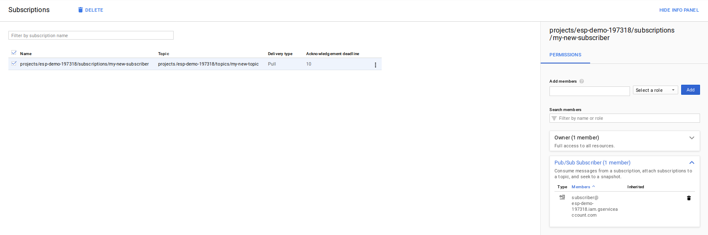

# Message Payload Encryption in Google Cloud PubSub (Part 1: Shared Secret)

This is the first part in the series which describes using a symmetric key to encrypt a Pub/Sub message.  We use AES256 and HMAC for encryption and signing.

## What exactly are we encrypting and signing?

Well, lets look at a (PubSub Message .proto](https://github.com/googleapis/googleapis/blob/master/google/pubsub/v1/pubsub.proto).  An actual wire message looks like this:
```proto
message PubsubMessage {
  The message payload.
  bytes data = 1;

 Optional attributes for this message.
  map<string, string> attributes = 2;

  // ID of this message, assigned by the server when the message is published.
  // Guaranteed to be unique within the topic. This value may be read by a
  // subscriber that receives a `PubsubMessage` via a `Pull` call or a push
  // delivery. It must not be populated by the publisher in a `Publish` call.
  string message_id = 3;

  // The time at which the message was published, populated by the server when
  // it receives the `Publish` call. It must not be populated by the
  // publisher in a `Publish` call.
  google.protobuf.Timestamp publish_time = 4;
}
```

If you look carefully, we cant encrypt the PubSubMessage entirely because some fields are generate after a message is submitted and more importantly, we need a place to save the encrypted message or signature data itself with the message.  One compromise is to crate a new field along with the data.  

That is, if the message you were going to submit looks like this:

```
message PubsubMessage {
   data = "foo"
   attributes = {
     "attribute1": "value1",
     "attribute2": "value2"
   }
}
```

### Encrypted message Formatter

Then what we're going to encrypt is a JSON struct for the message representation
```json
{
  "data": "foo",
  "attributes": {
    "attribute1": "value1",
    "attribute2": "value2"    
  }
}
```

So as transmitted PubSub Message:
```json
data:  <encrypted_message>
attributes: null
```

Note: we are encrypting and decrypting just the ```data:``` field with a json struct and embedding attributes within it.  What that means is the attributes within the  PubSubMessage may differ from the attributes placed within the encrypted message

### Signed message Formatter

For signed message, we need to transmit the message itself with the signature. For verification, we need will extract the signature in the header and compare. As was the case with encryption, we are verifying the payload within the ```data``` field.  As above, there maybe a variation between the PubSubMessage attributes and the attributes embedded in the data payload:

```json
json_message = {
    "data": "foo",
    "attributes": {
      "attribute1": "value1",
      "attribute2": "value2"    
    }
  }
```

So as transmitted PubSubMessage would be:

```json
data:  json_message
attributes:
   "signature": hmac(json_message)
```

Note: what this means is you can't use any attribute within the PubSubMessage for integrity checks; you must use the embedded attributes within the data: that we signed.  


## Simple message Encryption

Ok, Now that we're on the same field, lets run through the encryption.  There are may ways to do this and this will some of them starting off with basic ones and then moving on to using managed GCP services.

So..Whats the easiest way to sign or encrypt a message?  Symmetric key, right? ok, lets see what we can do.

We're going to setup and and distribute a symmetric key between Alice and Bob where each will keep that key available to the service pushing and pulling messages.  Basically, its a shared secret where the actual distribution of the key happened out of bad earlier.

Setup Pubsub Topics/Subscribers

```bash
export PROJECT_ID=`gcloud config get-value core/project`
export PROJECT_NUMBER=`gcloud projects describe $PROJECT_ID --format='value(projectNumber)'`

gcloud pubsub topics create my-new-topic
gcloud pubsub subscriptions create my-new-subscriber --topic=my-new-topic
```

### Encryption

We're going to use ```AES256``` key to encrypt out message.  We will first take a json field like this:

```
cleartext_message = {
    "data" : "foo".encode(),
    "attributes" : {
        'epoch_time':  int(time.time()),
        'a': "aaa",
        'c': "ccc",
        'b': "bbb"
    }
```

we will initialize a shared TINK AES key, encrypt it and finally transmit the encrypted message as the ```data``` field.   

Once the subscriber get this message, we will reverse it by extracting the message data and then decrypting it with our shared key:

You can initialize a new HMAC or AES key by running the `util.py` command with

```python
cc = AESCipher(encoded_key=None)
k = cc.getKey()
print(cc.printKeyInfo())

h = HMACFunctions(encoded_key=None)
k = h.getKey()
print(h.printKeyInfo())
```

The specific key here is a [Tink KeySet](https://github.com/google/tink/blob/master/docs/KEY-MANAGEMENT.md).  For more examples see [Simple Examples of using Tink Encryption library in Golang](https://github.com/salrashid123/tink_samples)

- Publisher
```log
$ python publisher.py  --mode encrypt --project_id  $PROJECT_ID --pubsub_topic my-new-topic \
      --key CNTdsdcDEmQKWAowdHlwZS5nb29nbGVhcGlzLmNvbS9nb29nbGUuY3J5cHRvLnRpbmsuQWVzR2NtS2V5EiIaIAf5r2mLlMM8FrY3QqJooMn5mK8BFpEVWR07es7neXECGAEQARjU3bHXAyAB

2021-11-14 09:00:43,604 INFO >>>>>>>>>>> Start <<<<<<<<<<<
2021-11-14 09:00:43,604 INFO Starting AES encryption
2021-11-14 09:00:43,605 INFO End AES encryption
2021-11-14 09:00:43,605 INFO Start PubSub Publish
2021-11-14 09:00:43,606 INFO Published Message: ATrsbtQnE/yvKT7H2qskouMf97glaXbOe5+DgJZaRFjp/mGmDkgLN1YwBMdjAPxVnb5sGAXvxvK6b3nF+kmImYZd1nDbMMJXQE0iI5BXsBm1ASdWvUtrW8lsi5rgqk4LPlC9s/AxG1t9EgU6EVSzzdCYkMtjhaIOYt7ww/q/
2021-11-14 09:00:43,989 INFO Published MessageID: 3343825236747786
2021-11-14 09:00:43,990 INFO End PubSub Publish
2021-11-14 09:00:43,990 INFO >>>>>>>>>>> END <<<<<<<<<<<
```

- Subscriber:
```log
$  python subscriber.py  --mode decrypt --project_id $PROJECT_ID --pubsub_subscription my-new-subscriber \
   --key CNTdsdcDEmQKWAowdHlwZS5nb29nbGVhcGlzLmNvbS9nb29nbGUuY3J5cHRvLnRpbmsuQWVzR2NtS2V5EiIaIAf5r2mLlMM8FrY3QqJooMn5mK8BFpEVWR07es7neXECGAEQARjU3bHXAyAB

2021-11-14 09:00:34,652 INFO >>>>>>>>>>> Start <<<<<<<<<<<
2021-11-14 09:00:35,127 INFO Listening for messages on projects/mineral-minutia-820/subscriptions/my-new-subscriber
2021-11-14 09:00:44,882 INFO ********** Start PubsubMessage 
2021-11-14 09:00:44,882 INFO Received message ID: 3343825236747786
2021-11-14 09:00:44,882 INFO Received message publish_time: 2021-11-14 14:00:43.878000+00:00
2021-11-14 09:00:44,885 INFO Decrypted data {"data": "foo", "attributes": {"epoch_time": 1636898443, "a": "aaa", "c": "ccc", "b": "bbb"}}
2021-11-14 09:00:44,885 INFO ACK message
2021-11-14 09:00:44,885 INFO End AES decryption
2021-11-14 09:00:44,885 INFO ********** End PubsubMessage
```

> The code all this can be found in the Appendix

### Signing

For signing, we do something similar where we're singing just what we would put into the 'data:' field and placing that in a specific PubSubMessage.attribute called ```signature=```.  In other words, we are HMAC signing the byte format of:
```json
message = {
    "data" : "foo".encode(),
    "attributes" : {
        "epoch_time':  int(time.time()),
        "a": "aaa",
        "c": "ccc",
        "b": "bbb"
    }
}
```

#### Output

Here is a sample run:

- Publisher

```log
$ python publisher.py  --mode sign  --project_id $PROJECT_ID --pubsub_topic my-new-topic \
    --key CKWPmvcHEmgKXAoudHlwZS5nb29nbGVhcGlzLmNvbS9nb29nbGUuY3J5cHRvLnRpbmsuSG1hY0tleRIoEgQIAxAgGiD2EEISnDEm0nrcySPD9mNiiMxf6vlsj5gH+KjXp+BmABgBEAEYpY+a9wcgAQ==

2021-11-14 09:01:34,468 INFO >>>>>>>>>>> Start <<<<<<<<<<<
2021-11-14 09:01:34,468 INFO Starting signature
2021-11-14 09:01:34,469 INFO End signature
2021-11-14 09:01:34,469 INFO Start PubSub Publish
2021-11-14 09:01:34,470 INFO Published Message: {"data": "foo", "attributes": {"epoch_time": 1636898494, "a": "aaa", "c": "ccc", "b": "bbb"}}
2021-11-14 09:01:34,470 INFO   with hmac: b'AX7mh6UbBt7MDUPlu90JT9vLMwKyYio9virLUp5Kphso2CzLyg=='
2021-11-14 09:01:34,774 INFO Published MessageID: 3343789993964544
2021-11-14 09:01:34,775 INFO End PubSub Publish
2021-11-14 09:01:34,775 INFO >>>>>>>>>>> END <<<<<<<<<<<
```

- Subscriber

```log
$  python subscriber.py --mode verify --project_id $PROJECT_ID --pubsub_subscription my-new-subscriber \
  --key CKWPmvcHEmgKXAoudHlwZS5nb29nbGVhcGlzLmNvbS9nb29nbGUuY3J5cHRvLnRpbmsuSG1hY0tleRIoEgQIAxAgGiD2EEISnDEm0nrcySPD9mNiiMxf6vlsj5gH+KjXp+BmABgBEAEYpY+a9wcgAQ==

2021-11-14 09:01:17,872 INFO >>>>>>>>>>> Start <<<<<<<<<<<
2021-11-14 09:01:18,353 INFO Listening for messages on projects/mineral-minutia-820/subscriptions/my-new-subscriber
2021-11-14 09:01:35,717 INFO ********** Start PubsubMessage 
2021-11-14 09:01:35,717 INFO Received message ID: 3343789993964544
2021-11-14 09:01:35,717 INFO Received message publish_time: 2021-11-14 14:01:34.767000+00:00
2021-11-14 09:01:35,717 INFO Starting HMAC
2021-11-14 09:01:35,718 INFO Verify message: b'{"data": "foo", "attributes": {"epoch_time": 1636898494, "a": "aaa", "c": "ccc", "b": "bbb"}}'
2021-11-14 09:01:35,718 INFO   With HMAC: AX7mh6UbBt7MDUPlu90JT9vLMwKyYio9virLUp5Kphso2CzLyg==
2021-11-14 09:01:35,719 INFO Message authenticity verified
2021-11-14 09:01:35,719 INFO ********** End PubsubMessage 
```

### The good and the bad

Ok, now that we went through all this...what are the issues with this approach:

- Plus:
    + Its faster than asymmetric keys.
    + Allows for confidentiality (encryption) and authentication/integrity (signatures)
    + There is no network round-trip just to encrypt; everything is done locally
    + Symmetric key is less CPU intensive compared to other schemes (eg. RSA)

- Minus
    - Its a shared secret; you have to accept risks of secret compromise.
    - Key compromise will allow decryption of all messages
    - Key Rotation requires a lot coordination between participant and maybe impractical.
    - Key distribution is an issue with large number of subscribers
    - Message attributes are not encrypted or signed though you can work around this by signing recreated canonical json format of the message.

The issues with symmetric keys like this should be clear and numerous.

## Conclusion

This is a simple way to encrypt or sign your messages. Its nothing new and quite obvious, its basically encrypting an arbitrary message with a specific scheme.  There are clear drawbacks as outlined above among several others.

Can we improve on this?  Lets see if using the [Service Account](https://cloud.google.com/storage/docs/authentication#service_accounts) private key we have locally helps with this in the next set of articles in the series

## Appendix


- Publisher


- Subscriber


### References

- [Kinesis Message Payload Encryption with AWS KMS ](https://aws.amazon.com/blogs/big-data/encrypt-and-decrypt-amazon-kinesis-records-using-aws-kms/)
- [Server-Side Encryption with AWS Kinesis](https://aws.amazon.com/blogs/big-data/under-the-hood-of-server-side-encryption-for-amazon-kinesis-streams/)
- [Envelope Encryption](https://cloud.google.com/kms/docs/envelope-encryption#how_to_encrypt_data_using_envelope_encryption)
- [Python Cryptography](https://cryptography.io/en/latest/)
- [PubSub Message proto](https://github.com/googleapis/googleapis/blob/master/google/pubsub/v1/pubsub.proto#L292)

