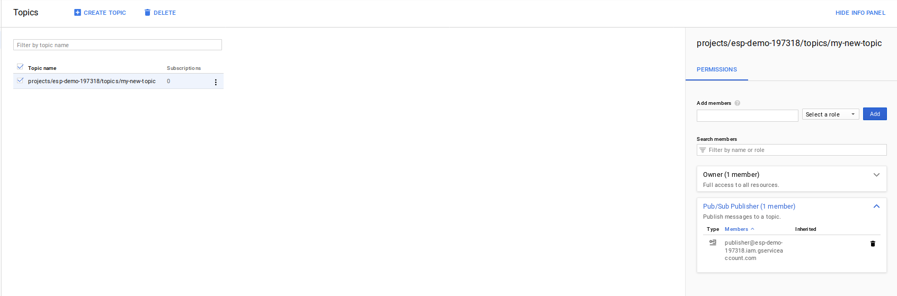

# Message Payload Encryption in Google Cloud PubSub (Part 3: Google Key Management System exclusively)

## Introduction

This is the third in a series exploring how to encrypt the message data payload within a Google Pub/Sub message.  This will not go into any real detail on the situations _why_ you want to ensure confidentiality or integrity of a given message but many of them were discussed in the first part of the series.   If you haven't already, please do read atleat the introduction section in the first part.

Anyway, what we've covered so far is a form of simple symmetric encryption where the sender and receiver are both using a static key.  We've also explored one way to use Google Cloud's service account public/private keys to sign and encrypt a message.   There are some advantages and disadvantages to these approaches as was outlined in those article.  We're here to see if we can improve on it or develop a different technique using Google's managed [Key Management System](https://cloud.google.com/kms/).

So, instead of sharing a symmetric key or overriding a PKI system, can we use the KMS system to encrypt the data itself?

## What exactly are we encrypting and signing?

This technique relies on the publisher having access to a KMS key to encrypt and the subscriber access to the __same__ key to decrypt a message.  We will be encrypting the *entire* message with KMS so there are not encryption keys in transit.  

We will be using this to encrypt and HMAC sign for confidentiality and integrity/authentication (respectively).

As mentioned, in-terms of what we're encrypting and signing, its the whole message done entirely on KMS (no local key generation or using a service accounts certificate/keys).  There several disadvantages to this as outlined at the end but lets go through this anyway.

### Encrypted message Formatter

For encrypted message, we need to transmit the message itself with the signature. For verification, we need will extract the signature in the header and compare. As was the case with encryption, we are verifying the payload within the ```data``` field.  As above, there maybe a variation between the Pub/SubMessage attributes and the attributes embedded in the data payload:

```json
_json_message = {
    "data": "foo",
    "attributes": {
      "attribute1": "value1",
      "attribute2": "value2"    
    }
  }
```

So as transmitted Pub/SubMessage would be:

```json
data:  encrypted(_json_message)
attributes:  
    kms_key: (kms_keyid)
```

## Signing messages

At the time of writing (6/3/18), GCP KMS supports [.encryt()](https://cloud.google.com/kms/docs/encrypt-decrypt#encrypt)  and [.decrypt()](https://cloud.google.com/kms/docs/encrypt-decrypt#decrypt) operations.  Its not possible to sign a message in the same sense as the other cases so I'll be skipping this

## Encryption

Ok, so how does this work?  Its pretty straight forward:

- Take the message you intended to send and make an KMS API call to encrypt it.
- Send the encrypted message in the Pub/Sub ```data:``` field and optionally specify a reference to the KMS key_id to use as a hint to the subscriber.

Easy enough, right?  Yes its too easy but has some severe practical limitations for high-volume, high-frequency PubSub messages


#### Output

- Publisher
```log
$ python publisher.py   --project_id mineral-minutia-820 --pubsub_topic my-new-topic  --kms_location_id us-central1 --kms_key_ring_id mykeyring --kms_crypto_key_id key1

2021-05-25 07:44:42,039 INFO >>>>>>>>>>> Start <<<<<<<<<<<
2021-05-25 07:44:42,456 INFO End KMS encryption API call
2021-05-25 07:44:42,456 INFO Start PubSub Publish
2021-05-25 07:44:42,960 INFO Published Message: CiUAmT+VVdb5NBYXakpiJoqtzwit3teHpAB26kuFCd/SARo1k134EoYBACsKZVIClk3OhBLgHVL29nK36E+J3o670+lDUSKYq99VjEAMZpvjFC23P2M3+6sQmLtDH4zJS/mrMSvXRUsP83CiiqQc5ATNZBj8minAA6IefauJfgjRVSahwZaDjazFPlT7blPs4AGTbnQOk3IAp8BmA4IUMH1wyTPTs+BIerTzo7V7LqM=
2021-05-25 07:44:43,355 INFO Published MessageID: 2472904674938088
2021-05-25 07:44:43,355 INFO End PubSub Publish
2021-05-25 07:44:43,355 INFO >>>>>>>>>>> END <<<<<<<<<<<
```

- Subscriber
```log
$ python subscriber.py  --project_id mineral-minutia-820 --pubsub_topic my-new-topic  --pubsub_subscription my-new-subscriber --kms_location_id us-central1 --kms_key_ring_id mykeyring --kms_crypto_key_id key1

2021-05-25 07:44:18,938 INFO Listening for messages on projects/mineral-minutia-820/subscriptions/my-new-subscriber
2021-05-25 07:44:44,357 INFO ********** Start PubsubMessage 
2021-05-25 07:44:44,357 INFO Received message ID: 2472904674938088
2021-05-25 07:44:44,358 INFO Received message publish_time: 2021-05-25 11:44:43.334000+00:00
2021-05-25 07:44:44,358 INFO Received message attributes["kms_key"]: projects/mineral-minutia-820/locations/us-central1/keyRings/mykeyring/cryptoKeys/key1
2021-05-25 07:44:44,358 INFO Starting KMS decryption API call
2021-05-25 07:44:44,788 INFO End KMS decryption API call
2021-05-25 07:44:44,788 INFO Decrypted data {"data": "foo", "attributes": {"epoch_time": 1621943082, "a": "aaa", "c": "ccc", "b": "bbb"}}
2021-05-25 07:44:44,788 INFO ACK message
2021-05-25 07:44:44,790 INFO ********** End PubsubMessage
```

## Execution Latency

I ran the full end to end tests here on a GCE instance and on my laptop from home.  I did this to compare the latency it took to run the KMS operation and intentionally did not pay attention to the time for  the pub/sub calls or  local key generation.

The reasons are fairly obvious: I wanted to gauge the relative network latency (even for one single call over a laptop/home connection).

What the output below shows is the subscriber side when a message is received.  It shows the pub/sub message, the KMS decryption and then the AES decryption.

> Note, all this is empirical and the numbers cited is just for one single API call.

### GCE

On GCE, the latency it took to unwrap the AES key from the KMS call was:

- ```Encrypt```:

```19:11:21,596``` --> ```19:11:21,709```    or about ```10ms```


- ```Decrypt```:

```19:11:26,409``` --> ```19:11:26,459```   or about ```10ms```


### Local

On my laptop from home, the latency it took to unwrap the AES key from the KMS call was:

- ```Encrypt```:
  ```9:02:30,329``` --> ```09:02:31,022```     or about ```700ms```


- ```Decrypt```:
 ```09:02:36,077``` -->  ```09:02:36,756```   about the same, ```700ms```

### the good and the bad

Ok, now that we went through all this...what are the issues with this approach:

- Plus:
    + All encryption is done on GCP; no need
    + No need for key distribution; key rotation, key management.
    + Access to encrypt/decrypt functions is configurable with IAM policies alone

- Minus
    - Extra network call to encrypt and decrypt (adds latency)
    - Additional costs with KMS api operations.
    - KMS is configured by [regions](https://cloud.google.com/kms/docs/locations). You may need to account for latency in remote API calls from the producer or subscriber.
    - Need to stay under PubSub maximum message size of 10GB
    - Dependency on the availably of another Service (in this case KMS)

## Conclusion

This is a simple way to encrypt or sign your messages with GCP's [Key Management System (KMS)](https://cloud.google.com/kms/docs/).  Its not doing anything particularly novel but shows you how to use KMS alone to encrypt/decrypt.

Ultimately, this isn't feasible or practical: for a service like pub/sub where latency is important, why add on this extra network dependency?

Right...so is there anyway we can iterate on this idea?   Yep, we can mitigate some of the network issues by using another technique that is a hybrid of the ones cited in the previous thread.  We'll cover that in the next and final article

## Appendix

### Code


### References

- [Kinesis Message Payload Encryption with AWS KMS ](https://aws.amazon.com/blogs/big-data/encrypt-and-decrypt-amazon-kinesis-records-using-aws-kms/)
- [Server-Side Encryption with AWS Kinesis](https://aws.amazon.com/blogs/big-data/under-the-hood-of-server-side-encryption-for-amazon-kinesis-streams/)
- [Envelope Encryption](https://cloud.google.com/kms/docs/envelope-encryption#how_to_encrypt_data_using_envelope_encryption)
- [Python Cryptography](https://cryptography.io/en/latest/)
- [PubSub Message proto](https://github.com/googleapis/googleapis/blob/master/google/pubsub/v1/pubsub.proto#L292)
---


### Config/Setup

Here is the setup i used in the screenshots below and testing

- Project:  ```esp-demo-197318```
- Service Accounts with JSON certificates
    - Publisher identity:   ```publisher@esp-demo-197318.iam.gserviceaccount.com```
    - Subscriber identity: ```subscriber@esp-demo-197318.iam.gserviceaccount.com```
- KeyRing+Key:  ```projects/esp-demo-197318/locations/us-central1/keyRings/mykeyring/cryptoKeys/key1```
- PubSub:
    - PUBSUB_TOPIC:  ```projects/esp-demo-197318/topics/my-new-topic```
    - PUBSUB_SUBSCRIPTION ```projects/esp-demo-197318/subscriptions/my-new-subscriber```

### Cloud KMS

The following describes the KMS setup in this article.  The steps outline how to create a KMS keyring, key and then set IAM permissions on that key so that the publisher can encrypt and the
subscriber can decrypt.  For this test, we enable IAM permission such that

- ```publisher@esp-demo-197318.iam.gserviceaccount.com``` can Encrypt
- ```subscriber@esp-demo-197318.iam.gserviceaccount.com``` can Decrypt


### PubSub

We do a similar configuration on the Pubsub side

setup a topic which to which you grant ```publisher@esp-demo-197318.iam.gserviceaccount.com``` the ability to post messages



and a subscription against that topic where ```projects/esp-demo-197318/subscriptions/my-new-subscriber``` can pull messages.


