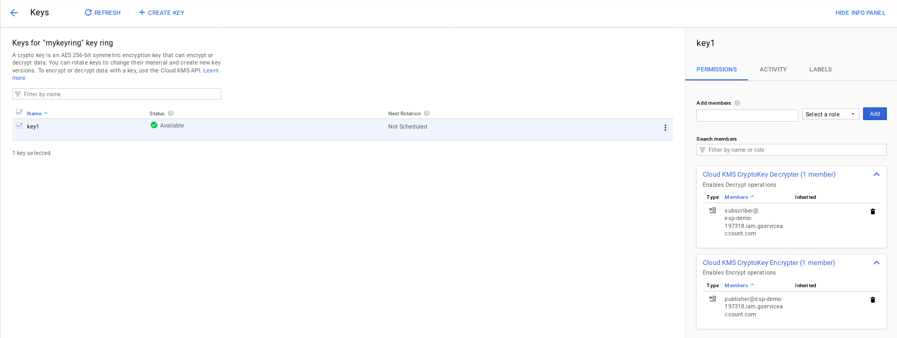

# Message Payload Encryption in Google Cloud Pub/Sub (Part 4: Envelope Encryption with Google Key Management System and PubSub)

## Introduction

In this mode, each pubsub message is encrypted by a symmetric key which is itself wrapped by a KMS key reference.

That is, if the original pubsub message looks like:

```json
_json_message = {
    "data": "foo",
    "attributes": {
      "attribute1": "value1",
      "attribute2": "value2"    
    }
  }
```

The wrapped message delivered to each subscriber would be:


```json
_json_message = {
    "data": "tjnGOdgyWib3qdrg4Hn+5OAStpq52Gaaz74MyrfewXbKE2BCleROKsUDQxmxUDbpLEAXg2DF15mzrkQe65358KM4uj/tS/",
    "attributes": {
      "kms_key": "projects/mineral-minutia-820/locations/us-central1/keyRings/mykeyring/cryptoKeys/key1",
      "dek_wrapped": "aaseMYA+6QqoVVl7+qs3H10qyp5eSzvz4EAib998s2M="    
    }
  }
```


Basically, this is another layer of [Envelope Encryption](https://cloud.google.com/kms/docs/envelope-encryption#how_to_encrypt_data_using_envelope_encryption) where what you're actually encrypting with KMS is the symmetric key you used to encrypt the PubsubMessage.  Once the key you used to encrypt your Pubsub data (data encryption key: DEK), you transmit the KMS-encrypted DEK along with the message itself.  

On the subscriber side, you get a KMS encrypted DEK and the message that is encrypted by the DEK.  You use KMS to unwrap the DEK and then finally use the plaintext DEK to decrypt the Pub/SubMessage.

One variation is that the DEK itself can be rotated by the publisher while the subscriber can expire its cache of known keys.

The publisher can pick a DEK for say 100 messages, transmit them and then create a new DEK.   Since the wrapped KMSEncrypted(DEK) is a message attribute, the subscriber can setup a local cache of KMSEncrypted(DEK)-> decrypted(DEK) map.  If it sees a wrapped DEK that it has in cache, it can "just decrypt' the message data.  If it does not see the wrapped dek in cache, it can make a KMS call to decrypt the new key and then save it in cache.


### Encryption

The flow is like this

* publisher:
  1. create a DEK_1 (a TINK AES key)
  2. use KMS to encrypt the DEK
  3. use DEK_1 to encrypt the pubsub message
  4. transmit N messages encrypted with DEK_1 and the encrypted DEK_1
  5. create a new DEK_2
  6. use KMS to encrypt DEK_2
  7. transmit N messages encrypted with DEK_2 and the encrypted DEK_2

* subscriber:
  1. read pubsub attribute for the encrypted DEK
  2. check local cache if that DEK has already been decrypted by KMS
  3. if cache miss, use KMS to decrypt the DEK, save the decrypted DEK to cache
  4. if cache hit, read decrypted DEK
  5. decrypt pubsub message with DEK


To recap how to use this mode:

First ensure you have two service accounts JSON files handy as `publisher.json` and `subscriber.json`:

`publisher@PROJECT.iam.gserviceaccount.com`, `subscriber@PROJECT.iam.gserviceaccount.com`

A topic and a subscriber on that topic:
topic: `my-new-topic`
subscription: `my-new-subscriber`


```bash
export PROJECT_ID=`gcloud config get-value core/project`
export PROJECT_NUMBER=`gcloud projects describe $PROJECT_ID --format='value(projectNumber)'`

gcloud pubsub topics create my-new-topic
gcloud pubsub subscriptions create my-new-subscriber --topic=my-new-topic

gcloud iam service-accounts create publisher
gcloud iam service-accounts create subscriber

gcloud kms keyrings create mykeyring  --location=us-central1
gcloud kms keys create key1 --keyring=mykeyring --purpose=encryption --location=us-central1
```

```
$ gcloud pubsub topics list-subscriptions my-new-topic
---
  projects/PROJECT/subscriptions/my-new-subscriber
```

Set IAM bindings
```
$ gcloud pubsub topics get-iam-policy my-new-topic
bindings:
- members:
  - serviceAccount:publisher@PROJECT.iam.gserviceaccount.com

$ gcloud pubsub subscriptions get-iam-policy my-new-subscriber
bindings:
- members:
  - serviceAccount:subscriber@PROJECT.iam.gserviceaccount.com
  role: roles/pubsub.subscriber
```

The KMS keyring `mykeyring` with an Encrption/Decrption key, `key`:

```
$ gcloud kms keys get-iam-policy --keyring mykeyring --location us-central1 key1
bindings:
- members:
  - serviceAccount:subscriber@PROJECT.iam.gserviceaccount.com
  role: roles/cloudkms.cryptoKeyDecrypter
- members:
  - serviceAccount:publisher@PROJECT.iam.gserviceaccount.com
  role: roles/cloudkms.cryptoKeyEncrypter

```

Anyway..

#### Output for Encryption

- Publisher
```log
$ python publisher.py  --mode encrypt --kms_project_id $PROJECT_ID --pubsub_topic my-new-topic \
  --kms_location us-central1 --kms_key_ring_id mykeyring --kms_key_id key1 --pubsub_project_id $PROJECT_ID  --tenantID A

2021-11-14 09:20:34,147 INFO >>>>>>>>>>> Start Encryption with locally generated key.  <<<<<<<<<<<
2021-11-14 09:20:34,147 INFO Rotating symmetric key
2021-11-14 09:20:34,149 INFO {
  "primaryKeyId": 1944542412,
  "key": [
    {
      "keyData": {
        "typeUrl": "type.googleapis.com/google.crypto.tink.AesGcmKey",
        "value": "GiB8r//J/uBf8j4KvsYBN4pGkL+qk0UueSLpNwXL7VyIpQ==",
        "keyMaterialType": "SYMMETRIC"
      },
      "status": "ENABLED",
      "keyId": 1944542412,
      "outputPrefixType": "TINK"
    }
  ]
}
2021-11-14 09:20:34,149 INFO Starting KMS encryption API call
2021-11-14 09:20:34,546 INFO Wrapped dek: CiUAmT+VVak5wQNHZQevTbSox8NVmPd/gBW6LtZtRK5gONX22tjHEroBABBpW9CQTCTTBFQWRXuwrJ72ONEbeMQz2M/3Cx09ma1hOVlhM5M1NwHZXZ5mud7cH0PnXDjtsU2l+6d8vT8I0HlMZoi7IsN+wEIg5v/xzQZHuncE63uHV9sY4tYVe8D0pZgrtVe6ydmYUDyzePFWgfQykIZ/lCRSmbDTOLYJJiAUqmrSx9UshXgahGJL2tkHi6sPigH2bOUJIbFWXtwfGk0SvzSb9x58et4KQgkoJIGehEFEv95ObrRv
2021-11-14 09:20:34,546 INFO End KMS encryption API call
2021-11-14 09:20:35,052 INFO Start PubSub Publish
2021-11-14 09:20:35,053 INFO Published Message: AXPnXMwKHY+0sP98m2hcgxHdpGRlWkYJ/V8HZUQse9Q4BNbYIS3ade9ieJjhl+J9QNmyCfJKoYLqzIxReO29EoNROCaOoPvAcnK/JMHNVqql/ISgcg/DhRl8ceuYi/x1+wfcHwFbFs4KI1m7IaFuR99k/4V8Nxyfb5IjL6Mc
2021-11-14 09:20:35,257 INFO Published MessageID: 2947786978049582
2021-11-14 09:20:36,260 INFO Published Message: AXPnXMySWMfcTY5+i3RQ8iqBzzkDiovN1nlgLu6dmYRM107JXT1ePwRV22RLf/+NO5nqtBPlfWbdxx1OpWFC2oNUxwiblfz9v2BWbGaiPd2JIhBJPAsV/QnVh7ney1rUtpheVSVxE1U4DF4iC8Vl4AGRf3L67bqz1Txi5hZW
2021-11-14 09:20:36,318 INFO Published MessageID: 3343866579605432
2021-11-14 09:20:37,320 INFO Published Message: AXPnXMz0JAxBJfAhuSwdEiNNck3iuYYsgn8Sb9KxabpXR7zQv3ow9XVRmTzDDcVu0yCuJeCaeVwBF+uJnbDRA0TkIS+Oub/V7fVmq5XREDjljgm8N9SE62W8wytzKQWyfe23BxkeFEjztmnDPFLwPzbAb2fDpHTPlp3YRObg
2021-11-14 09:20:37,389 INFO Published MessageID: 3343867546845460
2021-11-14 09:20:38,393 INFO Published Message: AXPnXMy/hPapDfCtUkNze/9Sq14QAOOJI/P9UXa+BtQCDax9a4l/3dW3tKA8eOqrLyPmlI3S4qqtzayh1iPnx+SiWmVv5rrA1ju9SUJRCOsVHVgoO/amfg4KxAlVEjxvVz4vzvTnbh1Hkvf6FoRiTOGkS/t396C+rchfeBse
2021-11-14 09:20:38,454 INFO Published MessageID: 3343867601655274
2021-11-14 09:20:39,456 INFO Published Message: AXPnXMxLVtdGc/ZifsGeJmhCP/w/HN6z5WdccgL7z3eXatT5/3whbs/xM/ASlovzGQNStp5H4HhgKa/EuyW8Nq+TjWqVANiAH3GObzFQQWOSFTb0+kfjrbUdHPiMBQID2WKoGMugMIrhzuUtsUaKhpKv5HQ1O/zYIW5ntGYg
2021-11-14 09:20:39,529 INFO Published MessageID: 3343867655027727
2021-11-14 09:20:40,531 INFO Rotating symmetric key
2021-11-14 09:20:40,533 INFO {
  "primaryKeyId": 96948524,
  "key": [
    {
      "keyData": {
        "typeUrl": "type.googleapis.com/google.crypto.tink.AesGcmKey",
        "value": "GiCMl5FTXM33GF3cNCTnFWgza5H+YQiEp/dRKHsqPeczqw==",
        "keyMaterialType": "SYMMETRIC"
      },
      "status": "ENABLED",
      "keyId": 96948524,
      "outputPrefixType": "TINK"
    }
  ]
}
2021-11-14 09:20:40,534 INFO Starting KMS encryption API call
2021-11-14 09:20:40,646 INFO Wrapped dek: CiUAmT+VVQI7ZZn7QjTKCPzuRaY1/CmIyiA9+MXIaeBkFgQ2TzjLEroBABBpW9D+E/nYwWglN/VH/AYijKcdW1BI4A2NMzlyndrQr/rNl+uKIVNKrgC1tnqjfxdNISY8E9D1xaW0XvNVZEHa1MmTRusKpuAlO3eZoUJdiTTl0ExFlxfps6uXFUNNsohWZ9r8bXOdFAqCOMItuTUxjc2BCUwKhG7gJkQkPIYtWWaOWVTkTSCaHvhoQHNWWYUd4PKHgEAlrk5uiyOJoznUbzquC2JBlfLxmpc4fCPym6dsUExtzsst
2021-11-14 09:20:40,646 INFO End KMS encryption API call
2021-11-14 09:20:41,134 INFO Start PubSub Publish
2021-11-14 09:20:41,135 INFO Published Message: AQXHUSwxOP/q9RdMnhxlvtZarSSGnPzdFkoV0eMtHqVbNdka4YzadAYHLGXYBtrCA+37ZP8ah4+hiBEIK7VulJ9u814an4P7Fw0C4McWPot6AzMt7mTYjtfY5btaOJe9obpBpEui/1O+KXaC/rdzrW/h7d3oSbB8Jst/qwqS
2021-11-14 09:20:41,293 INFO Published MessageID: 3343917187378431
2021-11-14 09:20:42,296 INFO Published Message: AQXHUSzrao4NfgAzY9kSQnex6SE7ZZikMpV7fLiaREkkL++chJ1+u9mWCHxMK1QiYpe9bUFw/Ii4ciRUM7wXiAKxxaPH/pIE3jC31zUVMeQhFiFi9cXxGeuKzqESWAbyCJHioM4imINBJj4OPvhsyVGPEHxa3KoGPagGQPdP
2021-11-14 09:20:42,356 INFO Published MessageID: 3343917431984649
2021-11-14 09:20:43,359 INFO Published Message: AQXHUSyHlfchRVdOZHjWM0IfEBqZMH7ZXhFPfZ6qOxYGu+H0BzDXI9JBjmLP9zu1cwqxPK4DO2n5XEfObyDE3bnqMqa9G9QX7k6FumldnlOyE4U4Xh7r1RSiLHGUxIVLPvTLCCNtc5v2IJk6gACkEEy6FBXFxLpX8Pjb7Szc
2021-11-14 09:20:43,427 INFO Published MessageID: 3343867066964201
2021-11-14 09:20:44,429 INFO Published Message: AQXHUSz5WxCmb+AhDM434TkTtTJ62DLGY55Ov+1tN3QuBNopBeUg6KlGIzK3eXVNlgR7L+bYyrZ2g2kGZElrA7uBtR/l9PJQT80l5KsILjDi/f0Ro2heWO4Fq9XvT6WyDkcIi2M0Pgb/3oACjH+PCiKTobFSSQzNX4P1+4EW
2021-11-14 09:20:44,482 INFO Published MessageID: 3343867440441361
2021-11-14 09:20:45,485 INFO Published Message: AQXHUSz3To6MjgW1SW/R7a+tWAtTTw4EODlt4YQPo725MGs+wMFWJdRsy5UXcQwzYoecp7SXqtTG9bAtk7AyWsgEOhpuo2B2ovc45kXgC3ivkJYA0uDcGY+OlLiOevNo1Tcepr/uBWgBE7qXOjRv0TdU9ft1rTjg+aYT0W+/
2021-11-14 09:20:45,543 INFO Published MessageID: 3343825800197618
...
2021-11-14 09:21:05,528 INFO >>>>>>>>>>> END <<<<<<<<<<<
```

- Subscriber:
```log
$ python subscriber.py  --mode decrypt  --pubsub_project_id $PROJECT_ID \
    --pubsub_topic my-new-topic --pubsub_subscription my-new-subscriber --tenantID A

2021-11-14 09:20:23,810 INFO >>>>>>>>>>> Start <<<<<<<<<<<
2021-11-14 09:20:23,814 INFO Listening for messages on projects/mineral-minutia-820/subscriptions/my-new-subscriber
2021-11-14 09:20:35,316 INFO ********** Start PubsubMessage 
2021-11-14 09:20:35,316 INFO Received message ID: 2947786978049582
2021-11-14 09:20:35,317 INFO Received message publish_time: 2021-11-14 14:20:35.252000+00:00
2021-11-14 09:20:35,317 INFO Received message attributes["kms_key"]: projects/mineral-minutia-820/locations/us-central1/keyRings/mykeyring/cryptoKeys/key1
2021-11-14 09:20:35,317 INFO Received message attributes["dek_wrapped"]: CiUAmT+VVak5wQNHZQevTbSox8NVmPd/gBW6LtZtRK5gONX22tjHEroBABBpW9CQTCTTBFQWRXuwrJ72ONEbeMQz2M/3Cx09ma1hOVlhM5M1NwHZXZ5mud7cH0PnXDjtsU2l+6d8vT8I0HlMZoi7IsN+wEIg5v/xzQZHuncE63uHV9sY4tYVe8D0pZgrtVe6ydmYUDyzePFWgfQykIZ/lCRSmbDTOLYJJiAUqmrSx9UshXgahGJL2tkHi6sPigH2bOUJIbFWXtwfGk0SvzSb9x58et4KQgkoJIGehEFEv95ObrRv
2021-11-14 09:20:35,317 INFO >>>>>>>>>>>>>>>>   Starting KMS decryption API call
2021-11-14 09:20:35,729 INFO Decrypted DEK CMy5nZ8HEmQKWAowdHlwZS5nb29nbGVhcGlzLmNvbS9nb29nbGUuY3J5cHRvLnRpbmsuQWVzR2NtS2V5EiIaIHyv/8n+4F/yPgq+xgE3ikaQv6qTRS55Iuk3BcvtXIilGAEQARjMuZ2fByAB
2021-11-14 09:20:35,730 INFO {
  "primaryKeyId": 1944542412,
  "key": [
    {
      "keyData": {
        "typeUrl": "type.googleapis.com/google.crypto.tink.AesGcmKey",
        "value": "GiB8r//J/uBf8j4KvsYBN4pGkL+qk0UueSLpNwXL7VyIpQ==",
        "keyMaterialType": "SYMMETRIC"
      },
      "status": "ENABLED",
      "keyId": 1944542412,
      "outputPrefixType": "TINK"
    }
  ]
}
2021-11-14 09:20:35,731 INFO Decrypted data {"data": "foo", "attributes": {"epoch_time": 1636899635, "a": "aaa", "c": "ccc", "b": "bbb"}}
2021-11-14 09:20:35,731 INFO ********** End PubsubMessage 
2021-11-14 09:20:36,358 INFO ********** Start PubsubMessage 
2021-11-14 09:20:36,358 INFO Received message ID: 3343866579605432
2021-11-14 09:20:36,359 INFO Received message publish_time: 2021-11-14 14:20:36.313000+00:00
2021-11-14 09:20:36,359 INFO Received message attributes["kms_key"]: projects/mineral-minutia-820/locations/us-central1/keyRings/mykeyring/cryptoKeys/key1
2021-11-14 09:20:36,359 INFO Received message attributes["dek_wrapped"]: CiUAmT+VVak5wQNHZQevTbSox8NVmPd/gBW6LtZtRK5gONX22tjHEroBABBpW9CQTCTTBFQWRXuwrJ72ONEbeMQz2M/3Cx09ma1hOVlhM5M1NwHZXZ5mud7cH0PnXDjtsU2l+6d8vT8I0HlMZoi7IsN+wEIg5v/xzQZHuncE63uHV9sY4tYVe8D0pZgrtVe6ydmYUDyzePFWgfQykIZ/lCRSmbDTOLYJJiAUqmrSx9UshXgahGJL2tkHi6sPigH2bOUJIbFWXtwfGk0SvzSb9x58et4KQgkoJIGehEFEv95ObrRv
2021-11-14 09:20:36,359 INFO Using Cached DEK
2021-11-14 09:20:36,359 INFO Decrypted data {"data": "foo", "attributes": {"epoch_time": 1636899636, "a": "aaa", "c": "ccc", "b": "bbb"}}
2021-11-14 09:20:36,359 INFO ********** End PubsubMessage 
2021-11-14 09:20:37,428 INFO ********** Start PubsubMessage 
2021-11-14 09:20:37,428 INFO Received message ID: 3343867546845460
2021-11-14 09:20:37,429 INFO Received message publish_time: 2021-11-14 14:20:37.369000+00:00
2021-11-14 09:20:37,429 INFO Received message attributes["kms_key"]: projects/mineral-minutia-820/locations/us-central1/keyRings/mykeyring/cryptoKeys/key1
2021-11-14 09:20:37,429 INFO Received message attributes["dek_wrapped"]: CiUAmT+VVak5wQNHZQevTbSox8NVmPd/gBW6LtZtRK5gONX22tjHEroBABBpW9CQTCTTBFQWRXuwrJ72ONEbeMQz2M/3Cx09ma1hOVlhM5M1NwHZXZ5mud7cH0PnXDjtsU2l+6d8vT8I0HlMZoi7IsN+wEIg5v/xzQZHuncE63uHV9sY4tYVe8D0pZgrtVe6ydmYUDyzePFWgfQykIZ/lCRSmbDTOLYJJiAUqmrSx9UshXgahGJL2tkHi6sPigH2bOUJIbFWXtwfGk0SvzSb9x58et4KQgkoJIGehEFEv95ObrRv
2021-11-14 09:20:37,429 INFO Using Cached DEK
2021-11-14 09:20:37,430 INFO Decrypted data {"data": "foo", "attributes": {"epoch_time": 1636899637, "a": "aaa", "c": "ccc", "b": "bbb"}}
2021-11-14 09:20:37,430 INFO ********** End PubsubMessage 
2021-11-14 09:20:38,495 INFO ********** Start PubsubMessage 
2021-11-14 09:20:38,496 INFO Received message ID: 3343867601655274
2021-11-14 09:20:38,496 INFO Received message publish_time: 2021-11-14 14:20:38.450000+00:00
2021-11-14 09:20:38,496 INFO Received message attributes["kms_key"]: projects/mineral-minutia-820/locations/us-central1/keyRings/mykeyring/cryptoKeys/key1
2021-11-14 09:20:38,497 INFO Received message attributes["dek_wrapped"]: CiUAmT+VVak5wQNHZQevTbSox8NVmPd/gBW6LtZtRK5gONX22tjHEroBABBpW9CQTCTTBFQWRXuwrJ72ONEbeMQz2M/3Cx09ma1hOVlhM5M1NwHZXZ5mud7cH0PnXDjtsU2l+6d8vT8I0HlMZoi7IsN+wEIg5v/xzQZHuncE63uHV9sY4tYVe8D0pZgrtVe6ydmYUDyzePFWgfQykIZ/lCRSmbDTOLYJJiAUqmrSx9UshXgahGJL2tkHi6sPigH2bOUJIbFWXtwfGk0SvzSb9x58et4KQgkoJIGehEFEv95ObrRv
2021-11-14 09:20:38,497 INFO Using Cached DEK
2021-11-14 09:20:38,497 INFO Decrypted data {"data": "foo", "attributes": {"epoch_time": 1636899638, "a": "aaa", "c": "ccc", "b": "bbb"}}
2021-11-14 09:20:38,497 INFO ********** End PubsubMessage 
2021-11-14 09:20:39,569 INFO ********** Start PubsubMessage 
2021-11-14 09:20:39,569 INFO Received message ID: 3343867655027727
2021-11-14 09:20:39,569 INFO Received message publish_time: 2021-11-14 14:20:39.524000+00:00
2021-11-14 09:20:39,569 INFO Received message attributes["kms_key"]: projects/mineral-minutia-820/locations/us-central1/keyRings/mykeyring/cryptoKeys/key1
2021-11-14 09:20:39,570 INFO Received message attributes["dek_wrapped"]: CiUAmT+VVak5wQNHZQevTbSox8NVmPd/gBW6LtZtRK5gONX22tjHEroBABBpW9CQTCTTBFQWRXuwrJ72ONEbeMQz2M/3Cx09ma1hOVlhM5M1NwHZXZ5mud7cH0PnXDjtsU2l+6d8vT8I0HlMZoi7IsN+wEIg5v/xzQZHuncE63uHV9sY4tYVe8D0pZgrtVe6ydmYUDyzePFWgfQykIZ/lCRSmbDTOLYJJiAUqmrSx9UshXgahGJL2tkHi6sPigH2bOUJIbFWXtwfGk0SvzSb9x58et4KQgkoJIGehEFEv95ObrRv
2021-11-14 09:20:39,570 INFO Using Cached DEK
2021-11-14 09:20:39,570 INFO Decrypted data {"data": "foo", "attributes": {"epoch_time": 1636899639, "a": "aaa", "c": "ccc", "b": "bbb"}}
2021-11-14 09:20:39,570 INFO ********** End PubsubMessage 
2021-11-14 09:20:41,335 INFO ********** Start PubsubMessage 
2021-11-14 09:20:41,336 INFO Received message ID: 3343917187378431
2021-11-14 09:20:41,336 INFO Received message publish_time: 2021-11-14 14:20:41.288000+00:00
2021-11-14 09:20:41,336 INFO Received message attributes["kms_key"]: projects/mineral-minutia-820/locations/us-central1/keyRings/mykeyring/cryptoKeys/key1
2021-11-14 09:20:41,336 INFO Received message attributes["dek_wrapped"]: CiUAmT+VVQI7ZZn7QjTKCPzuRaY1/CmIyiA9+MXIaeBkFgQ2TzjLEroBABBpW9D+E/nYwWglN/VH/AYijKcdW1BI4A2NMzlyndrQr/rNl+uKIVNKrgC1tnqjfxdNISY8E9D1xaW0XvNVZEHa1MmTRusKpuAlO3eZoUJdiTTl0ExFlxfps6uXFUNNsohWZ9r8bXOdFAqCOMItuTUxjc2BCUwKhG7gJkQkPIYtWWaOWVTkTSCaHvhoQHNWWYUd4PKHgEAlrk5uiyOJoznUbzquC2JBlfLxmpc4fCPym6dsUExtzsst
2021-11-14 09:20:41,336 INFO >>>>>>>>>>>>>>>>   Starting KMS decryption API call
2021-11-14 09:20:41,669 INFO Decrypted DEK CKyinS4SYwpYCjB0eXBlLmdvb2dsZWFwaXMuY29tL2dvb2dsZS5jcnlwdG8udGluay5BZXNHY21LZXkSIhogjJeRU1zN9xhd3DQk5xVoM2uR/mEIhKf3USh7Kj3nM6sYARABGKyinS4gAQ==
2021-11-14 09:20:41,671 INFO {
  "primaryKeyId": 96948524,
  "key": [
    {
      "keyData": {
        "typeUrl": "type.googleapis.com/google.crypto.tink.AesGcmKey",
        "value": "GiCMl5FTXM33GF3cNCTnFWgza5H+YQiEp/dRKHsqPeczqw==",
        "keyMaterialType": "SYMMETRIC"
      },
      "status": "ENABLED",
      "keyId": 96948524,
      "outputPrefixType": "TINK"
    }
  ]
}
2021-11-14 09:20:41,671 INFO Decrypted data {"data": "foo", "attributes": {"epoch_time": 1636899641, "a": "aaa", "c": "ccc", "b": "bbb"}}
2021-11-14 09:20:41,672 INFO ********** End PubsubMessage 
2021-11-14 09:20:42,400 INFO ********** Start PubsubMessage 
2021-11-14 09:20:42,401 INFO Received message ID: 3343917431984649
2021-11-14 09:20:42,401 INFO Received message publish_time: 2021-11-14 14:20:42.352000+00:00
2021-11-14 09:20:42,401 INFO Received message attributes["kms_key"]: projects/mineral-minutia-820/locations/us-central1/keyRings/mykeyring/cryptoKeys/key1
2021-11-14 09:20:42,401 INFO Received message attributes["dek_wrapped"]: CiUAmT+VVQI7ZZn7QjTKCPzuRaY1/CmIyiA9+MXIaeBkFgQ2TzjLEroBABBpW9D+E/nYwWglN/VH/AYijKcdW1BI4A2NMzlyndrQr/rNl+uKIVNKrgC1tnqjfxdNISY8E9D1xaW0XvNVZEHa1MmTRusKpuAlO3eZoUJdiTTl0ExFlxfps6uXFUNNsohWZ9r8bXOdFAqCOMItuTUxjc2BCUwKhG7gJkQkPIYtWWaOWVTkTSCaHvhoQHNWWYUd4PKHgEAlrk5uiyOJoznUbzquC2JBlfLxmpc4fCPym6dsUExtzsst
2021-11-14 09:20:42,401 INFO Using Cached DEK
2021-11-14 09:20:42,401 INFO Decrypted data {"data": "foo", "attributes": {"epoch_time": 1636899642, "a": "aaa", "c": "ccc", "b": "bbb"}}
2021-11-14 09:20:42,402 INFO ********** End PubsubMessage 
2021-11-14 09:20:43,480 INFO ********** Start PubsubMessage 
2021-11-14 09:20:43,480 INFO Received message ID: 3343867066964201
2021-11-14 09:20:43,480 INFO Received message publish_time: 2021-11-14 14:20:43.407000+00:00
2021-11-14 09:20:43,481 INFO Received message attributes["kms_key"]: projects/mineral-minutia-820/locations/us-central1/keyRings/mykeyring/cryptoKeys/key1
2021-11-14 09:20:43,481 INFO Received message attributes["dek_wrapped"]: CiUAmT+VVQI7ZZn7QjTKCPzuRaY1/CmIyiA9+MXIaeBkFgQ2TzjLEroBABBpW9D+E/nYwWglN/VH/AYijKcdW1BI4A2NMzlyndrQr/rNl+uKIVNKrgC1tnqjfxdNISY8E9D1xaW0XvNVZEHa1MmTRusKpuAlO3eZoUJdiTTl0ExFlxfps6uXFUNNsohWZ9r8bXOdFAqCOMItuTUxjc2BCUwKhG7gJkQkPIYtWWaOWVTkTSCaHvhoQHNWWYUd4PKHgEAlrk5uiyOJoznUbzquC2JBlfLxmpc4fCPym6dsUExtzsst
2021-11-14 09:20:43,481 INFO Using Cached DEK
2021-11-14 09:20:43,481 INFO Decrypted data {"data": "foo", "attributes": {"epoch_time": 1636899643, "a": "aaa", "c": "ccc", "b": "bbb"}}
2021-11-14 09:20:43,481 INFO ********** End PubsubMessage 
2021-11-14 09:20:44,521 INFO ********** Start PubsubMessage 
2021-11-14 09:20:44,522 INFO Received message ID: 3343867440441361
2021-11-14 09:20:44,522 INFO Received message publish_time: 2021-11-14 14:20:44.479000+00:00
2021-11-14 09:20:44,522 INFO Received message attributes["kms_key"]: projects/mineral-minutia-820/locations/us-central1/keyRings/mykeyring/cryptoKeys/key1
2021-11-14 09:20:44,522 INFO Received message attributes["dek_wrapped"]: CiUAmT+VVQI7ZZn7QjTKCPzuRaY1/CmIyiA9+MXIaeBkFgQ2TzjLEroBABBpW9D+E/nYwWglN/VH/AYijKcdW1BI4A2NMzlyndrQr/rNl+uKIVNKrgC1tnqjfxdNISY8E9D1xaW0XvNVZEHa1MmTRusKpuAlO3eZoUJdiTTl0ExFlxfps6uXFUNNsohWZ9r8bXOdFAqCOMItuTUxjc2BCUwKhG7gJkQkPIYtWWaOWVTkTSCaHvhoQHNWWYUd4PKHgEAlrk5uiyOJoznUbzquC2JBlfLxmpc4fCPym6dsUExtzsst
2021-11-14 09:20:44,522 INFO Using Cached DEK
2021-11-14 09:20:44,522 INFO Decrypted data {"data": "foo", "attributes": {"epoch_time": 1636899644, "a": "aaa", "c": "ccc", "b": "bbb"}}
2021-11-14 09:20:44,522 INFO ********** End PubsubMessage 
2021-11-14 09:20:45,585 INFO ********** Start PubsubMessage 
2021-11-14 09:20:45,585 INFO Received message ID: 3343825800197618
2021-11-14 09:20:45,586 INFO Received message publish_time: 2021-11-14 14:20:45.538000+00:00
2021-11-14 09:20:45,586 INFO Received message attributes["kms_key"]: projects/mineral-minutia-820/locations/us-central1/keyRings/mykeyring/cryptoKeys/key1
2021-11-14 09:20:45,586 INFO Received message attributes["dek_wrapped"]: CiUAmT+VVQI7ZZn7QjTKCPzuRaY1/CmIyiA9+MXIaeBkFgQ2TzjLEroBABBpW9D+E/nYwWglN/VH/AYijKcdW1BI4A2NMzlyndrQr/rNl+uKIVNKrgC1tnqjfxdNISY8E9D1xaW0XvNVZEHa1MmTRusKpuAlO3eZoUJdiTTl0ExFlxfps6uXFUNNsohWZ9r8bXOdFAqCOMItuTUxjc2BCUwKhG7gJkQkPIYtWWaOWVTkTSCaHvhoQHNWWYUd4PKHgEAlrk5uiyOJoznUbzquC2JBlfLxmpc4fCPym6dsUExtzsst
2021-11-14 09:20:45,586 INFO Using Cached DEK
2021-11-14 09:20:45,586 INFO Decrypted data {"data": "foo", "attributes": {"epoch_time": 1636899645, "a": "aaa", "c": "ccc", "b": "bbb"}}
2021-11-14 09:20:45,586 INFO ********** End PubsubMessage 
```


### Signing

For signing, we do something similar where we're singing just what we would put into the ```data:``` field and placing that in a specific PubSubMessage.attribute called ```signature=``` with the signature of the data and other attributes as sturct.

* publisher:
  1. create a SIGN_KEY_1  (a TINK HMAC key)
  2. use KMS to encrypt the SIGN_KEY_1
  3. use SIGN_KEY_1 to encrypt the pubsub message
  4. transmit N messages signed with SIGN_KEY_1 and the encrypted SIGN_KEY_1
  5. create a new SIGN_KEY_2
  6. use KMS to encrypt SIGN_KEY_2
  7. transmit N messages signed with SIGN_KEY_2 and the encrypted SIGN_KEY_2

* subscriber:
  1. read pubsub attribute for the encrypted SIGN_KEY
  2. check local cache if that SIGN_KEY has already been decrypted by KMS
  3. if cache miss, use KMS to decrypt the SIGN_KEY, save the decrypted SIGN_KEY to cache
  4. if cache hit, read decrypted SIGN_KEY
  5. verify pubsub message with SIGN_KEY


#### Output

- Publisher

```log
$ python publisher.py  --mode sign --kms_project_id $PROJECT_ID  \
  --pubsub_topic my-new-topic   --kms_location us-central1 \
  --kms_key_ring_id mykeyring --kms_key_id key1 --pubsub_project_id $PROJECT_ID --tenantID A

2021-11-14 09:30:36,994 INFO >>>>>>>>>>> Start Sign with with locally generated key. <<<<<<<<<<<
2021-11-14 09:30:36,995 INFO Rotating key
2021-11-14 09:30:36,997 INFO {
  "primaryKeyId": 1045123106,
  "key": [
    {
      "keyData": {
        "typeUrl": "type.googleapis.com/google.crypto.tink.HmacKey",
        "value": "EgQIAxAgGiC4spbxqg2Bf3BQ74mDY49E1X7A+CtSyZ37OY1NmwCjQg==",
        "keyMaterialType": "SYMMETRIC"
      },
      "status": "ENABLED",
      "keyId": 1045123106,
      "outputPrefixType": "TINK"
    }
  ]
}
2021-11-14 09:30:36,997 INFO Starting KMS encryption API call
2021-11-14 09:30:37,402 INFO Wrapped hmac key: CiUAmT+VVTlsUMB1Rui/fkSHtYjoPaUEPAOFNuDLTDZnZ+RlZP7hEsIBABBpW9CcoLUn3GKkSNFT+AQsfQMRRsPocQRSLETFjcnV0C3Nem+niuDaDAcCdcMwrWzbo/E6syom7ObSXth4W8C86FajH4mMoUESxqaHot7Yv6t7M9N45Rr+zBgi6PAmmSYxWl7HUYmZVGj/2sN70jByNuY1fLRpPlfoOhc/BQw/noYbgfboC5EVvlB08I0JZI5XlSLkHanPptMPMbccc57dUYapOkRsKrhgVmp5JkdE/zGF2z0bNFiegzGZg46zG+s=
2021-11-14 09:30:37,402 INFO End KMS encryption API call
2021-11-14 09:30:37,920 INFO Start PubSub Publish
2021-11-14 09:30:37,920 INFO Published Message: {'data': b'foo', 'attributes': {'epoch_time': 1636900237, 'a': 'aaa', 'c': 'ccc', 'b': 'bbb'}}
2021-11-14 09:30:37,920 INFO  with key_id: projects/mineral-minutia-820/locations/us-central1/keyRings/mykeyring/cryptoKeys/key1
2021-11-14 09:30:38,137 INFO Published MessageID: 3343918395926893
2021-11-14 09:30:39,139 INFO Start PubSub Publish
2021-11-14 09:30:39,140 INFO Published Message: {'data': b'foo', 'attributes': {'epoch_time': 1636900239, 'a': 'aaa', 'c': 'ccc', 'b': 'bbb'}}
2021-11-14 09:30:39,140 INFO  with key_id: projects/mineral-minutia-820/locations/us-central1/keyRings/mykeyring/cryptoKeys/key1
2021-11-14 09:30:39,208 INFO Published MessageID: 3343917584427227
2021-11-14 09:30:40,210 INFO Start PubSub Publish
2021-11-14 09:30:40,211 INFO Published Message: {'data': b'foo', 'attributes': {'epoch_time': 1636900240, 'a': 'aaa', 'c': 'ccc', 'b': 'bbb'}}
2021-11-14 09:30:40,212 INFO  with key_id: projects/mineral-minutia-820/locations/us-central1/keyRings/mykeyring/cryptoKeys/key1
2021-11-14 09:30:40,269 INFO Published MessageID: 3343918164472964
2021-11-14 09:30:41,271 INFO Start PubSub Publish
2021-11-14 09:30:41,272 INFO Published Message: {'data': b'foo', 'attributes': {'epoch_time': 1636900241, 'a': 'aaa', 'c': 'ccc', 'b': 'bbb'}}
2021-11-14 09:30:41,273 INFO  with key_id: projects/mineral-minutia-820/locations/us-central1/keyRings/mykeyring/cryptoKeys/key1
2021-11-14 09:30:41,328 INFO Published MessageID: 3343919040280466
2021-11-14 09:30:42,330 INFO Start PubSub Publish
2021-11-14 09:30:42,331 INFO Published Message: {'data': b'foo', 'attributes': {'epoch_time': 1636900242, 'a': 'aaa', 'c': 'ccc', 'b': 'bbb'}}
2021-11-14 09:30:42,332 INFO  with key_id: projects/mineral-minutia-820/locations/us-central1/keyRings/mykeyring/cryptoKeys/key1
2021-11-14 09:30:42,387 INFO Published MessageID: 3343917141321016
2021-11-14 09:30:43,389 INFO Rotating key
2021-11-14 09:30:43,390 INFO {
  "primaryKeyId": 593252320,
  "key": [
    {
      "keyData": {
        "typeUrl": "type.googleapis.com/google.crypto.tink.HmacKey",
        "value": "EgQIAxAgGiAbvmIQbFzHvFuWn6Wl1FNYSf9WOKEWqxxvIMiMnK/mag==",
        "keyMaterialType": "SYMMETRIC"
      },
      "status": "ENABLED",
      "keyId": 593252320,
      "outputPrefixType": "TINK"
    }
  ]
}
2021-11-14 09:30:43,391 INFO Starting KMS encryption API call
2021-11-14 09:30:43,685 INFO Wrapped hmac key: CiUAmT+VVYWMvUKk1pCToMIWeHsOMODv894JxA0Xp7hNHHA5mhc7EsIBABBpW9A0UvNnhkbEX9vJWs2GmWiZtB2izmuQGOQOsdF/YZnWoz13oETXuGeu8BZlRIn5c9Elcj3Tf988IaiWGtALbXrqdHETnYKhjtukBMaOv/t3v0y1VjoeOcdYjdyO7o9+PCLCLGnTU5G+mLrZbyHSmwSrhudzRg465TXa8VKKbgeARHo0ZIWmZHUgGkMNcXkbl9OAIS+3+MVIhRLAhnG6fRf1OOrHBhMqykUZMLOJy2mVfuNkXhV6W4Aikm7wqOQ=
2021-11-14 09:30:43,685 INFO End KMS encryption API call
2021-11-14 09:30:44,186 INFO Start PubSub Publish
2021-11-14 09:30:44,186 INFO Published Message: {'data': b'foo', 'attributes': {'epoch_time': 1636900244, 'a': 'aaa', 'c': 'ccc', 'b': 'bbb'}}
2021-11-14 09:30:44,186 INFO  with key_id: projects/mineral-minutia-820/locations/us-central1/keyRings/mykeyring/cryptoKeys/key1
```

- Subscriber
```log
$ python subscriber.py  --mode verify  --pubsub_project_id $PROJECT_ID  --pubsub_topic my-new-topic \
   --pubsub_subscription my-new-subscriber  --tenantID A

2021-11-14 09:30:34,510 INFO Listening for messages on projects/mineral-minutia-820/subscriptions/my-new-subscriber
2021-11-14 09:30:38,181 INFO ********** Start PubsubMessage 
2021-11-14 09:30:38,182 INFO Received message ID: 3343918395926893
2021-11-14 09:30:38,182 INFO Received message publish_time: 2021-11-14 14:30:38.132000+00:00
2021-11-14 09:30:38,182 INFO Received message attributes["kms_key"]: projects/mineral-minutia-820/locations/us-central1/keyRings/mykeyring/cryptoKeys/key1
2021-11-14 09:30:38,182 INFO Received message attributes["signature"]: AT5LUCJdpSGMUbuSZsyTNWyRjBe5150muXB1IAeS9v4HeHcIDQ==
2021-11-14 09:30:38,182 INFO >>>>>>>>>>>>>>>>   Starting KMS decryption API call
2021-11-14 09:30:38,564 INFO Decrypted HMAC CKKgrfIDEmgKXAoudHlwZS5nb29nbGVhcGlzLmNvbS9nb29nbGUuY3J5cHRvLnRpbmsuSG1hY0tleRIoEgQIAxAgGiC4spbxqg2Bf3BQ74mDY49E1X7A+CtSyZ37OY1NmwCjQhgBEAEYoqCt8gMgAQ==
2021-11-14 09:30:38,566 INFO {
  "primaryKeyId": 1045123106,
  "key": [
    {
      "keyData": {
        "typeUrl": "type.googleapis.com/google.crypto.tink.HmacKey",
        "value": "EgQIAxAgGiC4spbxqg2Bf3BQ74mDY49E1X7A+CtSyZ37OY1NmwCjQg==",
        "keyMaterialType": "SYMMETRIC"
      },
      "status": "ENABLED",
      "keyId": 1045123106,
      "outputPrefixType": "TINK"
    }
  ]
}
2021-11-14 09:30:38,566 INFO End KMS decryption API call
2021-11-14 09:30:38,566 INFO Message authenticity verified
2021-11-14 09:30:39,248 INFO ********** Start PubsubMessage 
2021-11-14 09:30:39,248 INFO Received message ID: 3343917584427227
2021-11-14 09:30:39,248 INFO Received message publish_time: 2021-11-14 14:30:39.203000+00:00
2021-11-14 09:30:39,249 INFO Received message attributes["kms_key"]: projects/mineral-minutia-820/locations/us-central1/keyRings/mykeyring/cryptoKeys/key1
2021-11-14 09:30:39,249 INFO Received message attributes["signature"]: AT5LUCK69KoJNqlanUI5gPvhWi6eYSjRLPZpgojCBJRp8aJ6Tw==
2021-11-14 09:30:39,249 INFO Using Cached DEK
2021-11-14 09:30:39,249 INFO Message authenticity verified
2021-11-14 09:30:40,309 INFO ********** Start PubsubMessage 
2021-11-14 09:30:40,310 INFO Received message ID: 3343918164472964
2021-11-14 09:30:40,310 INFO Received message publish_time: 2021-11-14 14:30:40.264000+00:00
2021-11-14 09:30:40,310 INFO Received message attributes["kms_key"]: projects/mineral-minutia-820/locations/us-central1/keyRings/mykeyring/cryptoKeys/key1
2021-11-14 09:30:40,310 INFO Received message attributes["signature"]: AT5LUCLoKzqcfmyIiNG6pbNGpMAkKP/Qmr1R1AhHiVjAayQjIg==
2021-11-14 09:30:40,310 INFO Using Cached DEK
2021-11-14 09:30:40,311 INFO Message authenticity verified
2021-11-14 09:30:41,367 INFO ********** Start PubsubMessage 
2021-11-14 09:30:41,367 INFO Received message ID: 3343919040280466
2021-11-14 09:30:41,367 INFO Received message publish_time: 2021-11-14 14:30:41.325000+00:00
2021-11-14 09:30:41,367 INFO Received message attributes["kms_key"]: projects/mineral-minutia-820/locations/us-central1/keyRings/mykeyring/cryptoKeys/key1
2021-11-14 09:30:41,368 INFO Received message attributes["signature"]: AT5LUCKfZQHTLOCbLj+TcjzLV3+ZXpRS594R1B1mNvk0t413Ew==
2021-11-14 09:30:41,368 INFO Using Cached DEK
2021-11-14 09:30:41,368 INFO Message authenticity verified
2021-11-14 09:30:42,425 INFO ********** Start PubsubMessage 
2021-11-14 09:30:42,425 INFO Received message ID: 3343917141321016
2021-11-14 09:30:42,425 INFO Received message publish_time: 2021-11-14 14:30:42.381000+00:00
2021-11-14 09:30:42,425 INFO Received message attributes["kms_key"]: projects/mineral-minutia-820/locations/us-central1/keyRings/mykeyring/cryptoKeys/key1
2021-11-14 09:30:42,425 INFO Received message attributes["signature"]: AT5LUCKcUBpivEcCkLCgYzG/rqMc3H61SAz4jim44oFmm3d8DQ==
2021-11-14 09:30:42,426 INFO Using Cached DEK
2021-11-14 09:30:42,426 INFO Message authenticity verified
2021-11-14 09:30:44,481 INFO ********** Start PubsubMessage 
2021-11-14 09:30:44,481 INFO Received message ID: 3343866033483195
2021-11-14 09:30:44,482 INFO Received message publish_time: 2021-11-14 14:30:44.400000+00:00
2021-11-14 09:30:44,482 INFO Received message attributes["kms_key"]: projects/mineral-minutia-820/locations/us-central1/keyRings/mykeyring/cryptoKeys/key1
2021-11-14 09:30:44,482 INFO Received message attributes["signature"]: ASNcT+BvUC229M8/xqjd4f5AVTD5peAbuOYp6wK8Wl6D0FQkhA==
2021-11-14 09:30:44,482 INFO >>>>>>>>>>>>>>>>   Starting KMS decryption API call
2021-11-14 09:30:44,588 INFO Decrypted HMAC COCf8ZoCEmgKXAoudHlwZS5nb29nbGVhcGlzLmNvbS9nb29nbGUuY3J5cHRvLnRpbmsuSG1hY0tleRIoEgQIAxAgGiAbvmIQbFzHvFuWn6Wl1FNYSf9WOKEWqxxvIMiMnK/mahgBEAEY4J/xmgIgAQ==
2021-11-14 09:30:44,589 INFO {
  "primaryKeyId": 593252320,
  "key": [
    {
      "keyData": {
        "typeUrl": "type.googleapis.com/google.crypto.tink.HmacKey",
        "value": "EgQIAxAgGiAbvmIQbFzHvFuWn6Wl1FNYSf9WOKEWqxxvIMiMnK/mag==",
        "keyMaterialType": "SYMMETRIC"
      },
      "status": "ENABLED",
      "keyId": 593252320,
      "outputPrefixType": "TINK"
    }
  ]
}
2021-11-14 09:30:44,589 INFO End KMS decryption API call
2021-11-14 09:30:44,589 INFO Message authenticity verified
2021-11-14 09:30:45,502 INFO ********** Start PubsubMessage 
2021-11-14 09:30:45,503 INFO Received message ID: 3343825148310174
2021-11-14 09:30:45,503 INFO Received message publish_time: 2021-11-14 14:30:45.461000+00:00
2021-11-14 09:30:45,503 INFO Received message attributes["kms_key"]: projects/mineral-minutia-820/locations/us-central1/keyRings/mykeyring/cryptoKeys/key1
2021-11-14 09:30:45,503 INFO Received message attributes["signature"]: ASNcT+D5uG6JwGIxoCYthTO+ecAp8r6G8jlc/r/800jG3n/Kow==
2021-11-14 09:30:45,503 INFO Using Cached DEK
2021-11-14 09:30:45,504 INFO Message authenticity verified

```


## Local Encryption and Cached Keys

There is going to be added network latency and other costs of using KMS.  One way to reduce the costs is to cache a symmetric key and expire it every now and then.   That is, the publisher can generate a symmetric key, use KMS to wrap it and keep using it for N seconds.   The subscriber would have to be notified of the expiration and lifetime but what that minimizes KMS api calls and also gives you fast symmetric key operations!

Basically, you are creating key, using KMS to wrap the key and save it in an ```ExpiringDict``` as shown below.

```python
from expiringdict import ExpiringDict

cache = ExpiringDict(max_len=100, max_age_seconds=60)
```

When you need to invoke a pubsub message, just use that cached key locally: no need for KMS.  Once the key expires, regenerate the key again and wrap it into the dict.  Rinse and Repeat.


### the good and the bad

Ok, now that we went through all this...what are the issues with this approach:

- Plus:
    + All encryption is done on GCP; no need
    + No need for key distribution; key rotation, key management.
    + Access to encrypt/decrypt functions is configurable with IAM policies alone

- Minus
    - Extra network call to encrypt and decrypt.
    - Additional costs with KMS api operations.
    - Slower (due to network hops).
    - KMS is configured by [regions](https://cloud.google.com/kms/docs/locations). You may need to account for latency in remote API calls from the producer or subscriber.     
    - Need to stay under PubSub maximum message size of 10MB
    - Dependency on the availability of another Service (in this case KMS)


## Conclusion

I've covered four techniques to encrypt your PubSub messages; some ideas are basic, some are good, some are bad.  I attempted to explain the pro/cons of each just to document.  My 2c is try going with kms+cache+symmetric keys as described here if the publisher and subscriber agree to a protocol..  You will reap the benefits of KMS entirely and provide a mechanism to ensure integrity and confidentially.  One obvious thing is the protocol for the message payload is something i just made up (i.e, saving the signature in a specific message attribute).  You are ofcourse welcome to use any scheme you want.


## Appendix

### Code

### References

- [Kinesis Message Payload Encryption with AWS KMS ](https://aws.amazon.com/blogs/big-data/encrypt-and-decrypt-amazon-kinesis-records-using-aws-kms/)
- [Server-Side Encryption with AWS Kinesis](https://aws.amazon.com/blogs/big-data/under-the-hood-of-server-side-encryption-for-amazon-kinesis-streams/)
- [Envelope Encryption](https://cloud.google.com/kms/docs/envelope-encryption#how_to_encrypt_data_using_envelope_encryption)
- [Python Cryptography](https://cryptography.io/en/latest/)
- [PubSub Message proto](https://github.com/googleapis/googleapis/blob/master/google/pubsub/v1/pubsub.proto#L292)

### Config/Setup

Here is the setup i used in the screenshots below and testing

- Project:  ```esp-demo-197318```
- Service Accounts with JSON certificates
    - Publisher identity:   ```publisher@esp-demo-197318.iam.gserviceaccount.com```
    - Subscriber identity: ```subscriber@esp-demo-197318.iam.gserviceaccount.com```
- KeyRing+Key:  ```projects/esp-demo-197318/locations/us-central1/keyRings/mykeyring/cryptoKeys/key1```
- PubSub:
    - PUBSUB_TOPIC:  ```projects/esp-demo-197318/topics/my-new-topic```
    - PUBSUB_SUBSCRIPTION ```projects/esp-demo-197318/subscriptions/my-new-subscriber```

### Cloud KMS

The following describes the KMS setup in this article.  The steps outline how to create a KMS keyring, key and then set IAM permissions on that key so that the publisher can encrypt and the
subscriber can decrypt.  For this test, we enable IAM permission such that

- ```publisher@esp-demo-197318.iam.gserviceaccount.com``` can Encrypt
- ```subscriber@esp-demo-197318.iam.gserviceaccount.com``` can Decrypt



### PubSub

We do a similar configuration on the Pubsub side

setup a topic which to which you grant ```publisher@esp-demo-197318.iam.gserviceaccount.com``` the ability to post messages


and a subscription against that topic where ```projects/esp-demo-197318/subscriptions/my-new-subscriber``` can pull messages.


